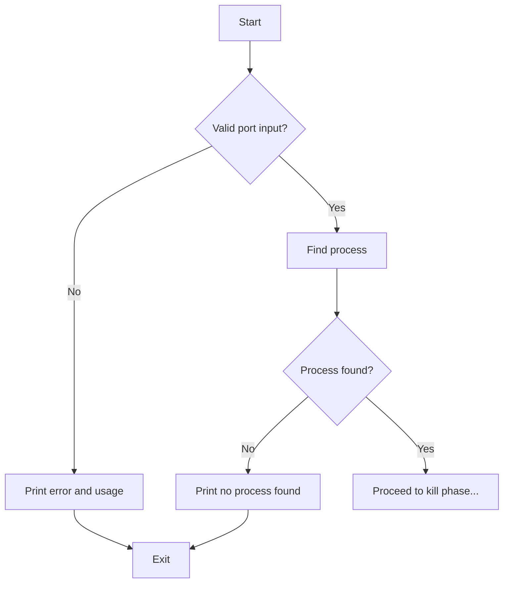

# 아키텍처 구조 – killport

이 문서는 `killport`의 내부 구성과 동작 흐름을 설명합니다. 간단한 단일 명령형 CLI이지만, 기능의 명확한 이해를 위해 구조를 시각화합니다.

---

## 주요 구성 요소

- **main.go**  
  CLI 진입점. 인자 파싱 및 실행 흐름 제어

- **portscanner.go**  
  주어진 포트에 대해 어떤 프로세스가 점유하고 있는지 식별

- **processkiller.go**  
  PID를 이용해 프로세스를 종료

- **prompter.go**  
  사용자 입력을 통해 종료 여부 결정

- **logger.go** (선택적, verbose 활성 시)  
  로그 출력 제어

---

## 동작 흐름

```mermaid
flowchart TD
    A[Start: CLI Input] --> B[Parse arguments]
    B --> C[Find process using port]
    C --> D{Process found?}
    D -- No --> E[Print "No process found"\nExit]
    D -- Yes --> F[Show PID and command]

    F --> G{Auto-confirm? (-y)}
    G -- Yes --> H[Kill process]
    G -- No --> I[Prompt user (y/N)]

    I -- Yes --> H
    I -- No --> J[Exit without killing]

    H --> K{Kill successful?}
    K -- Yes --> L[Print success message]
    K -- No --> M[Print failure message]

    L --> Z[End]
    M --> Z
    J --> Z
    E --> Z
```

## 예외 처리 흐름



## 확장 고려 사항

- 다중 포트 처리
- Linux 지원
- 포트 검색 기능
- PID 외 추가 정보 표시